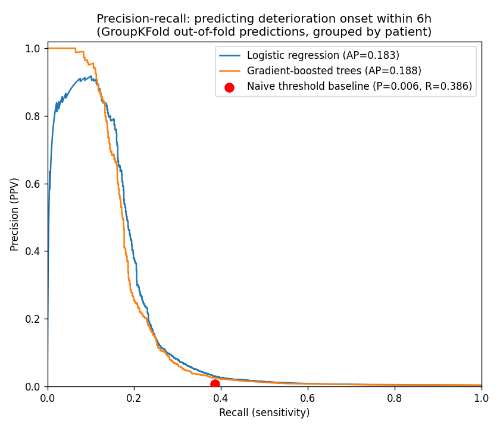
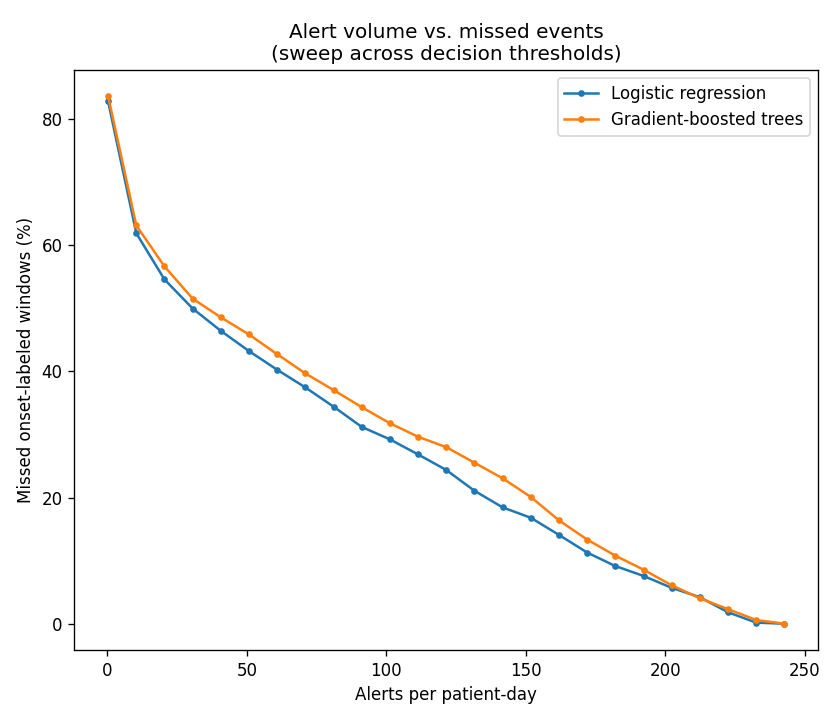
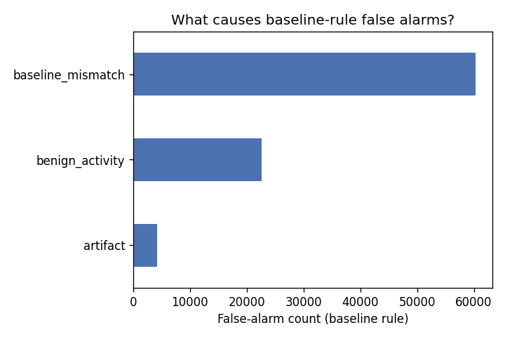
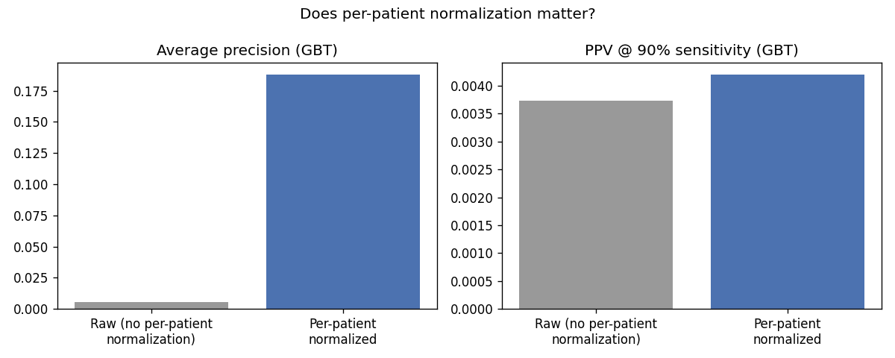
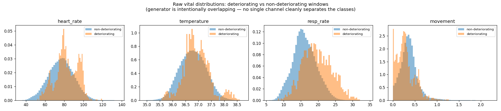

# Noma alert-triage prototype — summary report

**This is a synthetic-data demonstration of a triage approach, not a claim about real clinical performance.** All patients, vitals, and events in this report are generated by `data/generate.py`; no real patient data was used.

## Headline: alert volume at matched sensitivity

- Naive threshold baseline: **54.9 alerts/patient-day** (87,868 alerts over 1599 patient-days).

- On the row-level onset-window label used to evaluate both approaches, the baseline achieves **38.6% sensitivity** at **0.0063 precision** (it was never designed to hit 90% sensitivity — a fixed threshold with no persistence check catches some onsets by chance while flooding clinicians with unrelated alerts).

- GBT model matched to that **same 38.6% sensitivity** (probability threshold 0.612): **13.056 alerts/patient-day**.

- That is a **76.2% reduction** in alert volume at the same sensitivity, apples-to-apples on the same row-level label.

- If instead the target is a strict **90% sensitivity** (catch nearly every onset, the baseline cannot reach on this label at all): the GBT model needs **186.2 alerts/patient-day** (threshold 0.252) — the honest cost of insisting on near-total sensitivity against a rare, only partially-predictable event. See the tradeoff figure below for the full curve.


## Cross-validated performance (GroupKFold, 5 folds, grouped by patient)

| Model | Mean AP | Std AP | Mean PPV@90% sens. | Std PPV@90% sens. |
|---|---|---|---|---|
| Logistic regression | 0.183 | 0.108 | 0.004 | 0.001 |
| Gradient-boosted trees | 0.182 | 0.107 | 0.004 | 0.001 |

With only 18 deterioration-event patients, fold-to-fold variance is wide — reported honestly rather than collapsed to a single number.


## Precision-recall




## The tradeoff: alert volume vs. missed events



This is the figure that matters operationally: it shows the full tradeoff curve so a clinician (not this notebook) can choose the operating point.


## Why are baseline-rule alerts false alarms?



- **baseline_mismatch**: 60,257 (69.2%)
- **benign_activity**: 22,627 (26.0%)
- **artifact**: 4,198 (4.8%)

`baseline_mismatch` — a fixed population threshold flagging a patient whose personal normal is outside the population's normal — is the single largest cause, which is exactly the failure mode per-patient normalization is meant to fix.


## Does per-patient normalization matter?



- GBT average precision: **0.188 (normalized)** vs. 0.005 (raw values, no per-patient baseline).
- GBT PPV @ 90% sensitivity: **0.004 (normalized)** vs. 0.004 (raw).

This is the central thesis of the project: one patient's normal resting heart rate is another patient's alarm, and the ablation above tests whether accounting for that actually helps, rather than assuming it does.


## Which features carried the signal

Top logistic-regression coefficients (normalized features, by |coefficient|):

```
contact_quality_roll_1h    2.667800
cross_resp_move            0.734371
implausible_roll_1h       -0.704171
resp_rate_trend_1h        -0.567742
movement_trend_1h          0.491207
resp_rate_z                0.447698
heart_rate_trend_4h        0.434916
movement_z                -0.317959
```

Top GBT permutation importances (normalized features):

```
cross_resp_move            0.195235
resp_rate_z                0.147704
resp_persistence           0.121114
heart_rate_trend_4h        0.026966
resp_rate_trend_1h         0.019302
movement_trend_1h          0.013409
contact_quality_roll_1h    0.012464
temperature_trend_4h       0.007535
```


## Limitations

- **All data is synthetic.** Generated by a hand-written simulator (`data/generate.py`); it has not been validated against any real patient population. Nothing here is a claim about real-world sensitivity, specificity, or alert burden.
- **Event count is small.** Only 18 of 200 simulated patients ever deteriorate. Cross-validated metrics are reported with fold-to-fold variance for exactly this reason — point estimates from this few positive events are not reliable on their own.
- **No external validity.** The cohort, thresholds, and event generation were built for this repo. They do not represent any real device, hospital, or patient population.
- **The generator's assumptions bound what the model can learn.** Per-patient baseline variance, the overlap between benign activity and deterioration, and the artifact model were all authored choices (see the overlap-check figure below) — the model's apparent skill reflects those choices, not a property of real physiology.
- **Gradient boosting here is scikit-learn's `HistGradientBoostingClassifier`, not LightGBM/XGBoost** — both required an OpenMP runtime (`libomp`) not available on this machine's Python/Homebrew architecture combination; sklearn's GBT implementation avoids that dependency without changing the method.

### Generator overlap check

The generator was deliberately tuned so deterioration overlaps in magnitude with benign activity on every single channel (see below) — otherwise a naive single-vital rule could separate the classes and the exercise would demonstrate nothing.


